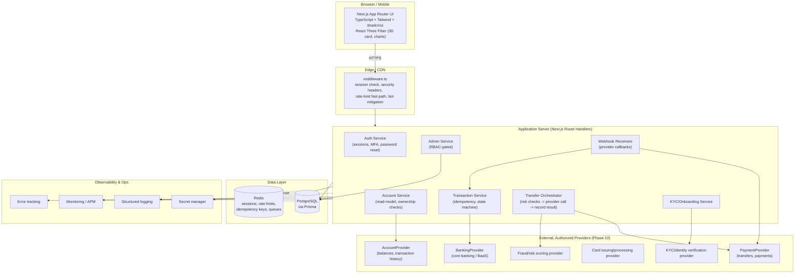
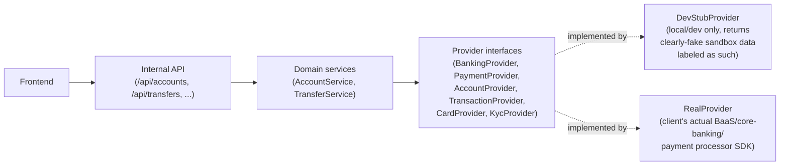

# Phase 2 — Production Architecture

## 1. Guiding principle

> **Granger Bank's database is a cache and a ledger of record for *its own* audit trail — never the source of truth for what money exists or where it is.** The source of truth for balances and settled transfers is always the licensed banking/payment provider. This shapes every decision below.

Concretely: when a customer looks at a balance in the app, that number either (a) was fetched live from the provider's Account Information API, or (b) is a cached copy explicitly labeled with an "as of" timestamp and reconciled on a schedule. The app's own `transactions` table records *what Granger Bank's platform attempted and observed*, not an independent claim about money that moved. This is what makes it possible to pass a financial audit later — the app never asserts a balance it can't trace back to the provider.

## 2. System diagram

## 3. Frontend

Kept from the current build, formalized:

- **Next.js (App Router) + TypeScript** — unchanged foundation.
- **Tailwind CSS** — unchanged design tokens (see the existing `globals.css` theme).
- **shadcn/ui** added as the primitive layer under the existing custom components (`Button`, form inputs, dialogs, dropdowns, tables, toasts). This replaces hand-rolled form controls with accessible, composable primitives, while the existing visual identity (gold/ink palette, Fraunces/Inter type) is applied via Tailwind theme + shadcn's CSS variable theming — the bank does not need to look like a shadcn template.
- **React Three Fiber** — kept for the hero card and cards-page showcase exactly as built. 3D is explicitly presentation-layer only: it never touches financial state and is fully optional (already has a WebGL-detection fallback and `prefers-reduced-motion` handling — see [Phase 11 notes](#11-ui-boundary)).
- **Data fetching**: server components fetch through internal service functions (not fetch-from-client-to-third-party). Client components that need live updates use a thin internal API (`/api/...`) that itself proxies to providers server-side. **The browser never holds a provider API key or calls a provider directly.**

## 4. Backend

- **Runtime**: Next.js Route Handlers (`src/app/api/**/route.ts`) as the initial API layer — no separate service needed at this scale, but every handler is written so it could be extracted into a standalone service later (thin controller, logic lives in `src/server/services/*`).
- **Database**: PostgreSQL, accessed exclusively through **Prisma** (schema in [03-database-schema.md](./03-database-schema.md)). No raw string-concatenated SQL anywhere.
- **Cache/queue**: Redis for session storage, rate-limit counters, idempotency-key locks, and a lightweight job queue (e.g. BullMQ) for async work — webhook processing, statement generation, notification delivery.
- **Authentication**: see [04-authentication-architecture.md](./04-authentication-architecture.md) in full; summarized here as: server-issued session, HttpOnly+Secure+SameSite cookie, Argon2id password hashing, TOTP-based MFA.
- **Authorization**: role- and ownership-based checks enforced in a service layer that every route handler must pass through — never optional, never "the frontend already checked."

## 5. Infrastructure

| Concern | Choice / approach |
|---|---|
| Production database | Managed PostgreSQL (e.g. RDS/Cloud SQL/Neon/Supabase — client's infra preference), with automated backups and point-in-time recovery enabled from day one |
| Secret management | Cloud provider secret manager (AWS Secrets Manager / GCP Secret Manager / Vault) injected as environment variables at deploy time — never committed, never in client bundles |
| Logging | Structured JSON logs (request id, user id where applicable, no sensitive financial data or secrets in log bodies), shipped to a log aggregator |
| Monitoring | APM (latency, error rate, saturation) plus business-metric dashboards (failed logins, transfer failure rate, provider error rate) |
| Error tracking | Sentry-class tool, server and client, PII-scrubbed before transmission |
| Rate limiting | Redis-backed sliding-window limiter at the edge (middleware) and per-endpoint in the service layer, tuned tighter on auth and transfer endpoints |
| Backup strategy | Automated daily full + continuous WAL/point-in-time backups for Postgres; documented restore drill on a schedule (see [08-deployment-architecture.md](./08-deployment-architecture.md)) |

## 6. Financial architecture — the integration layer

The requirement "must not rewrite the frontend when the real provider is connected" is met with a **provider abstraction boundary**. The frontend and internal services only ever talk to internal interfaces; those interfaces are implemented once against the client's actual provider (Phase 10). Full interface definitions are in [06-banking-provider-integration.md](./06-banking-provider-integration.md); the shape is:

Until Phase 10 identifies the client's real provider, every interface has exactly one implementation available outside local development: a **fail-closed stub** that returns a "provider not configured" error rather than a fabricated success. This is the mechanism that satisfies "do not simulate real banking functionality as if it were real" at the code level, not just as a policy statement — see [06](./06-banking-provider-integration.md#fail-closed-behavior) for the exact error contract.

## 7. Environment separation

Three fully isolated environments (databases, secrets, provider credentials — sandbox vs. production API keys where the provider distinguishes them):

- **development** — local Postgres (Docker), seeded fixture data clearly namespaced (`is_seed_data: true` where relevant), DevStubProvider active by default.
- **staging** — mirrors production infrastructure, connects to the provider's *sandbox/test* environment if one exists, used for pre-release verification and the client's UAT.
- **production** — real database, real secrets, real provider credentials, no seed/demo data path reachable (enforced at build time — see [12 in the implementation notes](./11-implementation-phases.md)).

Full detail in [08-deployment-architecture.md](./08-deployment-architecture.md).
