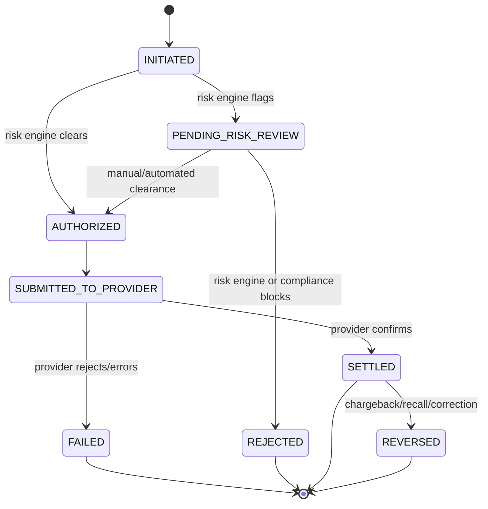

# Phase 5 — Transaction Architecture

## 1. Every transaction record contains

Mapped directly onto the `Transaction` model in [03-database-schema.md](./03-database-schema.md):

| Requirement | Field |
|---|---|
| Unique transaction ID | `id` (UUID, primary key) |
| Customer/account reference | `customerProfileId`, `sourceAccountId`, `destinationAccountId` |
| Amount | `amountMinor` (integer minor units — never float) |
| Currency | `currency` (ISO 4217) |
| Direction | `direction` (`DEBIT`/`CREDIT`) |
| Timestamp | `initiatedAt`, plus `authorizedAt`/`settledAt`/`failedAt` as the lifecycle progresses |
| Status | `status` (enum state machine, §3) |
| Reference | `reference` (customer-facing memo) |
| Description | `description` |
| Source | `sourceAccountId` / `sourceAccount` |
| Destination | `destinationAccountId` or `beneficiaryId` |
| Audit trail | `TransactionStatusEvent` rows (one per transition) + `AuditLog` rows for any admin-touched action |

## 2. Idempotency

**Problem this solves:** a user double-clicks "Send," a mobile client retries after a timeout, or a network blip causes a resubmission — none of these should create a second transfer.

**Mechanism:**
1. The client generates an idempotency key (UUID v4) once, when the transfer form is submitted, and keeps it fixed across retries of *that* submission (not regenerated on retry).
2. The key is sent as a required field/header on the transfer request.
3. The server treats `Transaction.idempotencyKey` as a unique constraint. On insert:
   - If no row exists with that key, proceed normally.
   - If a row exists with that key, **return the existing transaction's current state** instead of creating a new one or erroring — the caller gets the same answer whether this is the first or fifth delivery of the same logical request.
4. A short-lived Redis lock on the idempotency key covers the window between "request received" and "row committed," so two concurrent requests with the same key can't both pass the "no row exists" check before either commits (the classic TOCTOU race with unique-constraint-only idempotency).

This satisfies "implement idempotency protection" and "prevent duplicate transaction submission" as two sides of the same mechanism, enforced at the database constraint level (cannot be bypassed by an application bug) and at the request-handling level (cannot be bypassed by a race).

## 3. Transaction state machine



Rules:
- **Every transition writes a `TransactionStatusEvent` row** (`fromStatus`, `toStatus`, `reason`, `actor`) — the `Transaction.status` column is a denormalized "current state" for fast queries, never the only record of what happened.
- **No transition skips a step programmatically.** Even a request that's obviously going to be authorized still passes through `INITIATED` first — this guarantees the audit trail is complete and consistent, and makes replay/reconciliation against provider webhooks straightforward (match on `providerTxnRef`).
- **`SUBMITTED_TO_PROVIDER` → `SETTLED`/`FAILED` is driven by the provider's response or webhook, never assumed.** The application does not mark a transaction settled because the HTTP call to the provider returned 200 — it marks it settled when the provider's response body or a subsequent webhook explicitly confirms settlement, per that provider's actual API contract (defined once Phase 10 names the provider).

## 4. Authorization and ownership — enforced server-side, always

Before any transaction is created:

1. **Session check** — is there a valid, non-expired session? (§ auth doc)
2. **Ownership check** — does `sourceAccountId` belong to the authenticated `customerProfileId`? This query happens on the server against the database on every request; it is never inferred from anything the client sent about "whose account this is."
3. **Status check** — is the source account `ACTIVE` (not `RESTRICTED`/`CLOSED`)? Is the beneficiary `VERIFIED` (not `PENDING_VERIFICATION`/`BLOCKED`)?
4. **Balance/limit check** — sufficient available balance (from the provider's live or freshly-cached balance, §5), within any per-transaction/per-day limits configured for the account/customer segment.
5. **Risk/fraud check** — velocity rules, amount thresholds, and (once integrated) the fraud provider's score.

**The frontend never modifies a balance directly, at any point.** There is no client-writable balance field anywhere in the schema — `Account.cachedBalanceMinor` is written only by server-side jobs that read from the provider. A transfer request from the client is a *request*; the resulting balance change, if any, is a side effect the provider reports back, which the server then reflects.

## 5. Balance handling specifically

Because balances come from the provider (per the architecture principle in [02](./02-production-architecture.md#1-guiding-principle)):

- Before authorizing a transfer, the service layer calls `AccountProvider.getBalance()` (or uses a cache no older than a configured freshness window, e.g. a few seconds, for high-volume read paths) rather than trusting `cachedBalanceMinor` blindly for a decision that moves money.
- Display-only balance reads (dashboard overview) may use the cache with a visible "as of" timestamp if the provider imposes rate limits that make live calls impractical for every page view — this is a UX/cost tradeoff, never a financial-decision shortcut.

## 6. Transaction service responsibilities (interface sketch, not implementation)

```ts
// src/server/services/transactionService.ts — INTERFACE ONLY, not implemented yet.
// Every method enforces auth + ownership internally; callers cannot opt out.

interface CreateTransferInput {
  idempotencyKey: string;
  customerProfileId: string;
  sourceAccountId: string;
  destinationAccountId?: string;
  beneficiaryId?: string;
  amountMinor: bigint;
  currency: string;
  reference: string;
  description?: string;
}

interface TransactionService {
  createTransfer(input: CreateTransferInput, ctx: AuthContext): Promise<Transaction>;
  getTransaction(id: string, ctx: AuthContext): Promise<Transaction>;
  listTransactions(filter: TransactionFilter, ctx: AuthContext): Promise<Transaction[]>;
  handleProviderWebhook(payload: ProviderWebhookPayload): Promise<void>;
}
```

`AuthContext` (resolved server-side from the session, never from client-supplied fields) carries `userId`, `customerProfileId`, `role`, and permissions, and every method above uses it to enforce §4 before touching the database or calling a provider.

## 7. What this explicitly rules out

- No route or service method accepts a raw balance value from the client and writes it.
- No "instant success" transaction is created without first passing through `INITIATED` → risk → `AUTHORIZED` → provider submission.
- No duplicate transaction can be created by retry, double-click, or concurrent request, per §2.
- No transaction status is set to `SETTLED` on the strength of the app's own say-so — only on the provider's.
