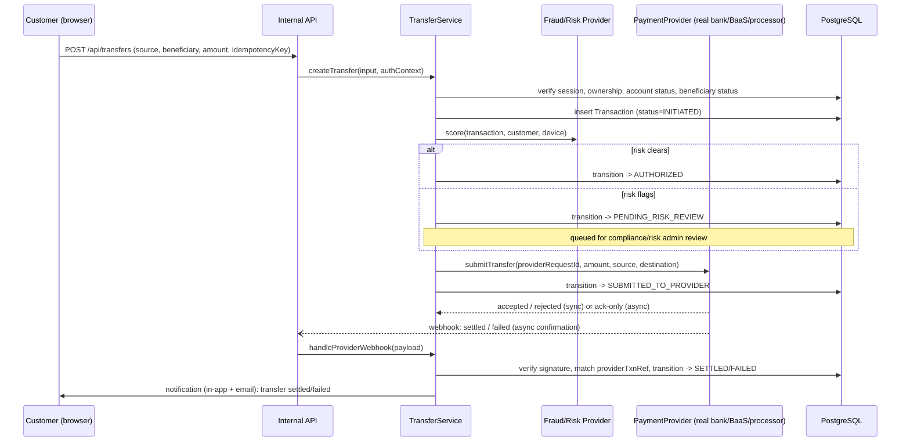

# Phase 6 & 10 — Transfer Workflow and Banking Provider Integration

## 1. Transfer workflow (end to end)



Mapped directly to the brief's 10 steps: account/beneficiary/amount selection (client) → backend validation → risk check → authorization → provider call → provider response verification → status recorded → confirmation. Steps 4–9 all happen server-side; the client never sees or controls the intermediate states beyond polling/subscribing to status.

**No step in this flow changes a balance by writing a number into the `Account` table.** The only writes are `Transaction`/`TransactionStatusEvent` rows describing what was requested and what the provider reported. Balance display is refreshed by re-querying `AccountProvider` (or invalidating the cache) after a webhook confirms settlement.

## 2. Provider abstraction interfaces

These are the four interfaces named in the brief, plus two the schema/KYC design already implies. **Interfaces only — no implementation ships until Phase 10 (below) is resolved with the client.**

```ts
// src/server/providers/types.ts — INTERFACE DEFINITIONS ONLY

interface BankingProvider {
  // Core banking / BaaS operations: account lifecycle at the ledger level.
  openAccount(request: OpenAccountRequest): Promise<ProviderAccountRef>;
  closeAccount(accountRef: string): Promise<void>;
  getAccountStatus(accountRef: string): Promise<ProviderAccountStatus>;
}

interface AccountProvider {
  // Account Information Services (read-side): balances, transaction history.
  getBalance(accountRef: string): Promise<{ availableMinor: bigint; ledgerMinor: bigint; currency: string; asOf: Date }>;
  listTransactions(accountRef: string, range: DateRange): Promise<ProviderTransaction[]>;
}

interface PaymentProvider {
  // Movement of money: transfers, payments, ACH/wire/RTP as the provider supports.
  submitTransfer(request: SubmitTransferRequest): Promise<{ providerTxnRef: string; status: string }>;
  getTransferStatus(providerTxnRef: string): Promise<{ status: string; settledAt?: Date; failureReason?: string }>;
  verifyWebhookSignature(rawBody: string, signatureHeader: string): boolean;
}

interface CardProvider {
  // Card issuing/processing: the provider owns PAN/CVV; we hold references.
  issueCard(request: IssueCardRequest): Promise<{ providerCardRef: string; last4: string }>;
  freezeCard(providerCardRef: string): Promise<void>;
  unfreezeCard(providerCardRef: string): Promise<void>;
  cancelCard(providerCardRef: string): Promise<void>;
}

interface KycProvider {
  // Identity verification — see Phase 9. Never locally decided.
  startVerification(customer: KycSubject): Promise<{ providerCaseId: string }>;
  getVerificationStatus(providerCaseId: string): Promise<{ status: KycStatus; riskRating?: RiskRating; reason?: string }>;
}

interface FraudRiskProvider {
  scoreTransaction(input: RiskScoringInput): Promise<{ score: number; flags: string[] }>;
  scoreLogin(input: LoginRiskInput): Promise<{ score: number; flags: string[] }>;
}
```

Every domain service (`TransferService`, `AccountService`, `CardService`, `KycService`) depends on these interfaces, not on a specific vendor SDK. Swapping providers, or adding a second provider for a specific market/currency, means writing a new class that implements the interface — the route handlers, the database schema, and the entire frontend are unaffected.

## 3. Fail-closed behavior {#fail-closed-behavior}

Until a real provider is configured, **each interface has exactly one implementation registered outside local development: a stub that fails closed.**

```ts
// src/server/providers/unconfiguredProvider.ts — the ONLY non-dev implementation
// available until BANKING_API_URL etc. are set for a given provider.

class UnconfiguredPaymentProvider implements PaymentProvider {
  async submitTransfer(): Promise<never> {
    throw new ProviderNotConfiguredError(
      "PaymentProvider is not configured for this environment. " +
      "No transfer can be submitted until a licensed provider is integrated."
    );
  }
  // ...same pattern for every method on every interface.
}
```

- This error is caught by the API layer and surfaced to the customer as a clear "this feature isn't available yet" state — **never** as a fabricated success, and never as a generic 500 that might be mistaken for a transient glitch worth retrying into a duplicate.
- It is also what the current mock UI screens (`dashboard/transfers`, `dashboard/payments`, `admin/transfers`, `dashboard/cards` freeze/unfreeze) get wired to as an intermediate step: real request, real validation, real audit log entry for the attempt — provider call fails closed with a clear message, instead of a `setState(true)`.
- Local development is the only environment where a `DevStubProvider` returns synthetic sandbox-like responses, and every response it returns is tagged (`provider: "dev-stub"` on the `Transaction` row) so it is structurally impossible to confuse a dev-stub result with a real one, including in logs and in the database.

## 4. What Phase 10 requires before any real implementation is written

**We do not choose or assume a provider.** This section is a checklist for the client's team, not a recommendation.

1. **Identify the category(ies) of provider already contracted or preferred:**
   - Core banking platform (the client already operates as/with a chartered bank), or
   - Banking-as-a-Service provider (e.g., a BaaS platform sitting on top of a chartered bank), or
   - Payment processor (for card/ACH movement without full core-banking scope), or
   - Separate providers for account information, transfers, and card issuing (common — these are often different vendors).
2. **Supply that provider's sandbox credentials and API documentation.** Engineering implements against their actual API contract (request/response shapes, webhook signature scheme, status vocabulary) — not a guess.
3. **Confirm the legal relationship** — is Granger Bank a licensed entity, a program managed under a sponsor bank via the BaaS provider, or an agent/reseller? This affects what the app is legally allowed to say about itself (see [10-compliance-and-regulatory.md](./10-compliance-and-regulatory.md)) and which entity is the merchant/money-transmitter of record.
4. Full list of required credentials and business documentation is in [09-client-requirements-and-credentials.md](./09-client-requirements-and-credentials.md).

## 5. Configuration contract (names only — no values)

```bash
# .env.example — committed to the repo. Never contains real values.
# Real values live only in the secret manager for staging/production,
# and in a local, gitignored .env.local for development.

DATABASE_URL=
REDIS_URL=

SESSION_SECRET=
CSRF_SECRET=

# Set once a provider is selected per Phase 10. Absence of these is what
# keeps every provider call routed to the fail-closed stub.
BANKING_API_URL=
BANKING_API_KEY=
BANKING_CLIENT_ID=
BANKING_CLIENT_SECRET=
BANKING_WEBHOOK_SIGNING_SECRET=

PAYMENT_API_URL=
PAYMENT_API_KEY=

CARD_PROVIDER_API_URL=
CARD_PROVIDER_API_KEY=

KYC_PROVIDER_API_URL=
KYC_PROVIDER_API_KEY=

FRAUD_PROVIDER_API_URL=
FRAUD_PROVIDER_API_KEY=

# Observability
SENTRY_DSN=
LOG_LEVEL=
```

Handling rules (enforced in code review and, where possible, CI lint):
- `.env.example` lists names only, forever — a pre-commit/CI check rejects any diff to it that adds a value.
- No `BANKING_*`/`PAYMENT_*`/`*_API_KEY` variable is ever read in a file under `src/app/**/page.tsx`, any client component, or anything shipped to the browser. They are read exclusively in `src/server/**`, which is enforced by Next.js's server/client module boundary (importing a server-only module from a client component is a build error) plus a lint rule banning `process.env.*_KEY` outside `src/server`.
