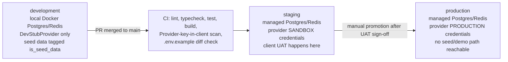

# Phase 12 & 14 — Environment Separation and Deployment Architecture

## 1. Environments

- **development** — Docker Compose for Postgres + Redis, `.env.local` (gitignored) with dev-only values, `DevStubProvider` active for every provider interface by default. Seed script populates realistic-looking fixture data explicitly so engineers never need real customer data locally; every seeded row is identifiable as such in a `is_seed_data` flag or a reserved email domain (e.g. `@seed.grangerbank.internal`) so it can never be mistaken for production data in a screenshot or log line.
- **staging** — mirrors production's infrastructure shape exactly (same Postgres version, same Redis, same app runtime) but points at the provider's **sandbox/test** endpoints and credentials where the provider offers them. This is where the client's own UAT and any provider-required certification testing happens.
- **production** — real secrets from the secret manager, real provider credentials, real customer data. The build pipeline fails closed if any staging/dev-only flag, mock provider, or seed-data path is reachable in a production build (see §4).

## 2. Database migrations

- Prisma Migrate, migrations committed to version control, applied via a controlled deploy step (never `prisma db push` against production).
- Every migration is reviewed for backward compatibility with the currently-deployed application version (additive-first: add nullable column → backfill → deploy code that uses it → make non-null in a later migration), so deploys and migrations can be sequenced without downtime.
- Migrations run in a dedicated step with a role that has DDL rights; the application's runtime role does not have `ALTER`/`CREATE`/`DROP` — separating "can change schema" from "can run the app" (also relevant to the audit-log append-only guarantee in [07](./07-security-architecture.md#7-audit-logging)).

## 3. Secure deployment configuration

- Infrastructure as code (Terraform or the equivalent for the chosen cloud) so environment configuration is reviewable and reproducible, not clicked together once and forgotten.
- Secrets injected at deploy/runtime from the secret manager — never baked into a container image, never in a committed `.env` file beyond `.env.example`'s empty names.
- Principle of least privilege for every service identity (the app's database role, the app's cloud IAM role) — scoped to exactly what that service needs.

## 4. Preventing demo data / mock providers from reaching production

Concrete, enforced mechanisms (not just a policy):

1. **Build-time assertion**: the production build step fails if `NODE_ENV=production` and any `BANKING_*`/`PAYMENT_*`/etc. provider variable resolves to a value containing `stub`, `mock`, `sandbox`, or `test` (string check against the configured provider base URL), and fails if those variables are unset entirely (no silent fallback to the stub in production — it must be an explicit, loud failure, since a fail-closed provider in prod means the bank literally cannot process transfers, which should page someone, not fail silently).
2. **Seed script is dev/staging only**: the seed command checks `NODE_ENV` and refuses to run against anything it detects as a production database URL (hostname allowlist/denylist check), in addition to normal infra-level access controls preventing engineers from having production database credentials at all.
3. **`mockData.ts`-style fixtures are deleted, not gated**: the current `src/lib/mockData.ts` pattern (hardcoded arrays imported directly by page components) is removed entirely from the app source in the production rebuild. Its replacement (seed data for local dev) lives under a `prisma/seed.ts` / `fixtures/` path that is never imported by any `src/app/**` page — there is no code path by which fixture data can render in a real deployment, because the pages read from the database/services, not from a fixture file.

## 5. Monitoring, logging, error tracking (deployment-relevant specifics)

- Health checks (`/api/health`) covering database and Redis connectivity, and provider reachability (a degraded-but-serving state if a non-critical provider is down, a hard-fail health check if the payment provider is unreachable, since that's core to the product).
- Dashboards for: auth failure rate, transfer failure rate, provider error rate/latency, queue depth (webhook processing backlog), p95/p99 API latency.
- Alerting thresholds tied to on-call paging for anything touching money movement failures or a spike in security events (§ suspicious activity in [07](./07-security-architecture.md#11-suspicious-activity-detection)).
- Error tracking scrubs PII/financial values from captured exceptions before transmission (custom `beforeSend` filtering) — a stack trace should never contain a real account number or password.

## 6. Backup strategy & disaster recovery

- Automated daily full backups + continuous point-in-time recovery (WAL archiving) for Postgres, retained per the client's regulatory record-keeping requirement (commonly 7 years for financial records — confirmed with legal/compliance, not assumed — see [10-compliance-and-regulatory.md](./10-compliance-and-regulatory.md)).
- Quarterly (minimum) restore drills — a backup that has never been restored in a rehearsal is not a verified backup.
- Documented RTO/RPO targets agreed with the client before launch; disaster recovery runbook covering "primary region down," "provider outage" (money-movement degrades gracefully — new transfers queue or are blocked with clear customer messaging, existing data remains readable), and "database corruption" scenarios separately, since they have different correct responses.
- Because balances are provider-sourced, a Granger Bank database disaster is recoverable without financial data loss in the strongest sense — the ledger of record survives at the provider even if Granger Bank's own cache/audit copy needs to be rebuilt from backup and reconciled. This is one of the practical payoffs of the architecture principle in [02](./02-production-architecture.md#1-guiding-principle), not just a compliance nicety.
